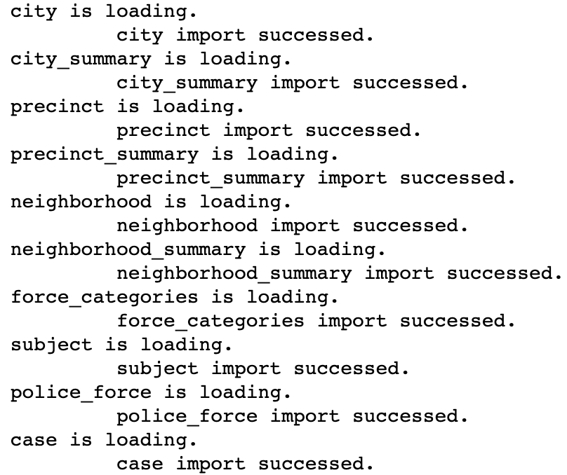
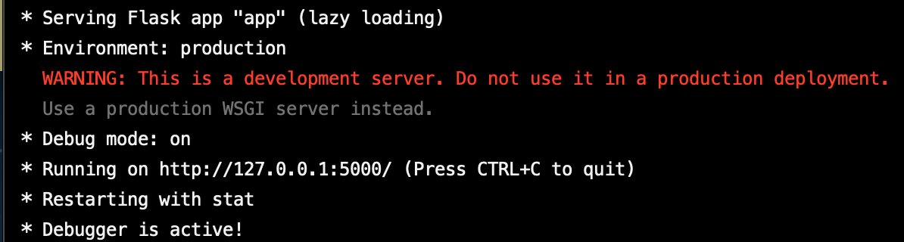
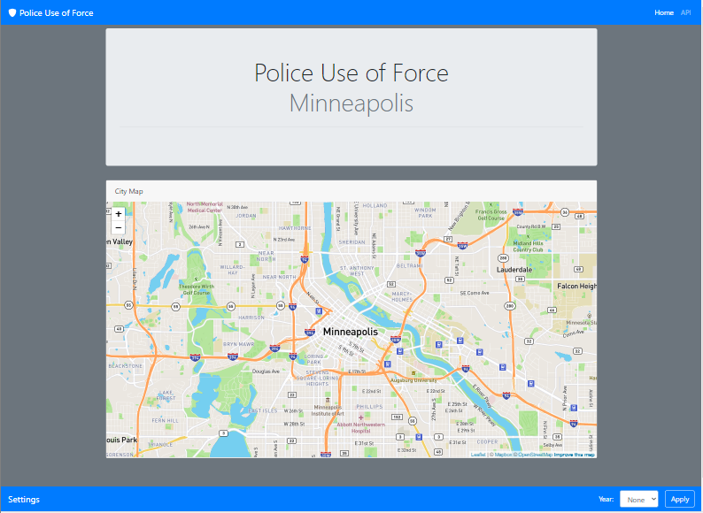
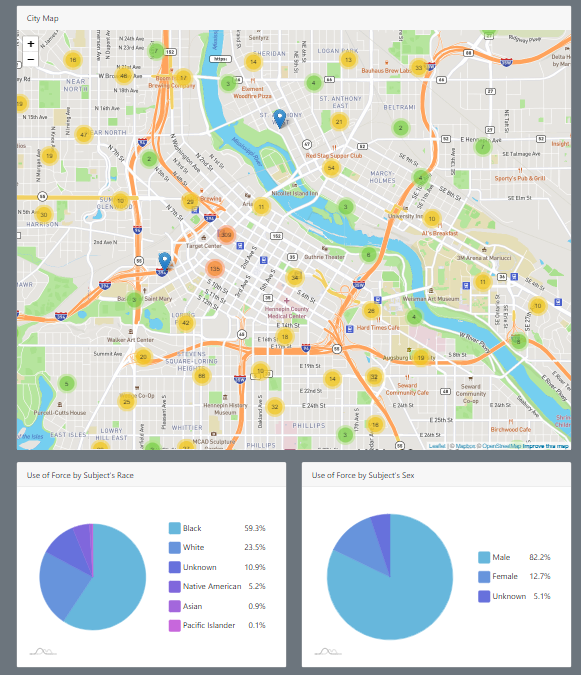
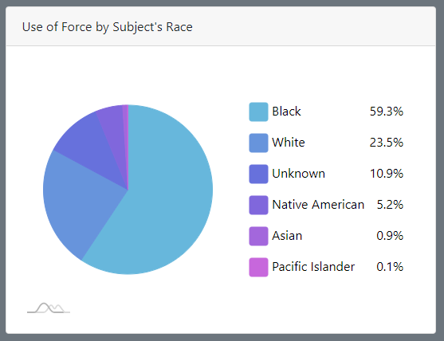
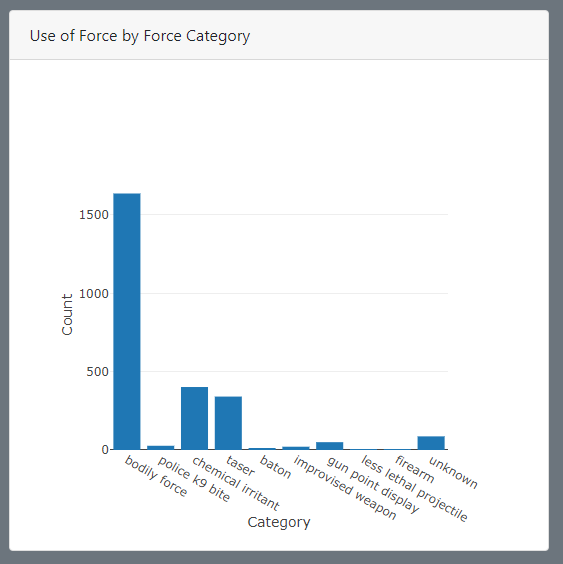
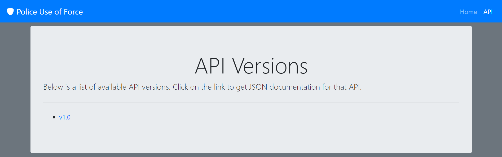
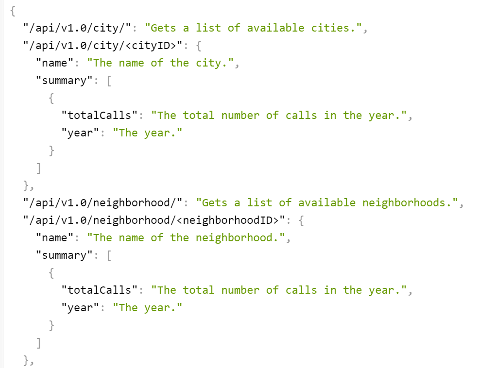

# Use of Police Force in Minneapolis

<em>Aaron Wollman, Kelsey Richardson Blackwell, Will Huang, Mark Erickson</em>

This project looks at the use of police force within cases in Minneapolis. 

## Project Proposal

[Link to Project Proposal](https://docs.google.com/document/d/1S8f17_1JH-xNafa9AJuODPuJU724BTAQOyuVbggtQM4/)

## How to Run

### Configuration Files

#### Javascript

<ol>
  <li>
    Navigate to static > js.
  </li>
  <li>
    Make a copy of <strong>config.template.js</strong> in the js directory.
	</li>
	<li>
    Rename this file to <strong>config.js</strong>.
	</li>
	<li>
	Edit the file, replacing the variables with the proper values.
	</li>
</ol>

#### Python

<ol>
  <li> 
    Make a copy of <strong>config.template.py</strong> in the root directory of this project. (UMN-Data_Analytics-Project_02)
  </li>
  <li>
    Rename this file to <strong>config.py</strong>.
  </li>
  <li>
	  Edit the file, replacing the variables with the proper values.
	</li>
</ol>

### Setup Database

For the database, this project uses a PostgresSQL database for storing police force data.
This database needs to be created and populated by following the steps below.

#### Create Schema

<ol>
  <li>
    Open an instance of pgAdmin.
  </li>
  <li>
		Create a PostgresSQL database and name it police_force.
	</li>
  <li>
    Run <strong>database/queries/create.sql</strong> to generate the tables within the new database.
  </li>
  <li>
		In the sidebar under the database that ran create.sql, open Schemas > public > Tables.
		There should be 10 tables:
        <ul>
          <li>case</li>
          <li>city</li>
          <li>city_summary</li>
          <li>force_categories</li>
          <li>neighborhood</li>
          <li>neighborhood_summary</li>
          <li>police_force</li>
          <li>precinct</li>
          <li>precinct_summary</li>
          <li>subject</li>
        </ul>
         A refresh might be required by Right Click > Refresh.
	</li>
</ol>

Here is what the database should look like:

If something goes wrong and you need to redo these instructions, make sure to run <strong>database/queries/delete.sql</strong> before the above instructions so that the tables are cleared and deleted.

### Populate Database

To populate the database, a Jupyter Notebook has been written that goes over the Extract-Transform-Load process for the police force data.

#### Use Jupyter Notebook for ETL Process
<ol>
  <li>
    Run a <strong>Command Prompt</strong> (for windows) or <strong>Terminal</strong> (for mac).
  </li>
  <li>
    Initialize an Anaconda environment using "source activate {your environment}".
  </li>
  <li>
     Navigate your terminal to directory /database/etl.
  </li>
  <li>
    In the termanal run "jupyter notebook", which will open a Jupyter Notebook in the browser.
  </li>
  <li>
    Run <strong>etl.ipynb</strong> in the Jupyter Notebook.
  </li>
  <li>
    With the code open, you have two options on how to run the code:
    <ul>
      <li>
        In the menu bar open Kernel > Restart and Clear Output.  Then you can use Shift+Enter to run the code one block at a time.
      </li>
      <li>
        In the menu bar open Kernel > Restart and Run All.  This will run all of the blocks of code at once.
      </li>
    </ul>
  </li>
  The last dialog should show something like this if the ETL process has been run successfully: 
  
</ol>

#### Verify ETL Process

<ol>
  <li>
    Open an instance of pgAdmin.
  </li>
  <li>
    Open a query under <strong>police_force</strong> database.
  </li>
  <li>
    Run <strong>database/queries/check.sql</strong> to check the tables within the police_force.
  </li>
</ol>

### Setup Web Server

#### Utilize Flask as Web Server

<ol>
  <li>
    Run a <strong>Command Prompt</strong> (for windows) or <strong>Terminal</strong> (for mac).
  </li>
  <li>
    Initialize an Anaconda environment using "source activate {your environment}".
  </li>
  <li>
    Change the directory in the terminal to the root directory of this project.
  </li>
  <li>
    Run <strong>python app.py</strong> as the command. In the output of the command, there should be a URL hosted on your computer to access.  Use Google Chrome to open that URL.
     The output should look like this: 
    
  </li>
</ol>

## Web Site
After finishing the <strong>How to Run section</strong>, the server should be running and the database should be populated.  The server should be running from a URL outputted in the <strong>Utilize Flask as Web Server section</strong>.  This URL will be the localhost URL.

### Browsing the Homepage

<ol>  
  <li>
    Open a browser and enter the localhost URL to go to the homepage.
  </li>
  <li>
    You should see a webpage similar to the below screenshot:
    
  </li>
  <li>
    Use the fields in the Settings footer to change which data appears on the webpage. Click the Apply button to populate the webpage based on the Settings. It may take up to a minute to load the data.  The webpage should populate with visualizations similar to the below screenshot:
    
  <li>
</ol>

#### The Visualizations
Once the settings have been applied from the <strong>Browsing the Webpage section</strong>, the following visualizations should be populated:

##### City Map
The city map uses marker clusters to show the numbers of cases which occured in the area. Zoom in or click on a cluster to provide more details on the clusters. Zoom in far enough, and you should see individual markers on the map, each representing a case. Click on the marker to get more details on that specific case:

##### Pie Charts
There are three pie charts to view:
<ul>
  <li>
  Use of Force by Subject's Race
  </li>
  <li>
  Use of Force by Subject's Sex
  </li>
  <li>
  Use of Force by Subject's Age
  </li>
</ul>

Each of these pie charts summarize the data based on the currently applied Settings on the page. All of the pie charts have a legend that shows the distribution within the pie chart.  Clicking on a label within the legend will remove the data from that specific pie chart.

##### Bar Chart

The bar chart shows the Use of Force by Force Category. Each Use of Force is categorized into a category used by the police department.  This bar chart shows the distribution of these categories based on the page's Settings.

### JSON API Documentation

#### API Version

To view documentation on the API versions there are two methods:
<ol>
  <li>
    In Chrome, go to <strong>{localhost URL}/api</strong> to view the list of API versions.
  </li>
  <li>
    Open the homepage in Chrome. Click on the API link within the header.
  </li>
</ol>

Using either method, you should see the following page:

Clicking on the link corresponding to the API version will open a JSON with documentation on the API endpoints and their JSON output.

## Sources

Police force data from [Open Minneapolis](https://opendata.minneapolismn.gov/datasets/police-use-of-force).
