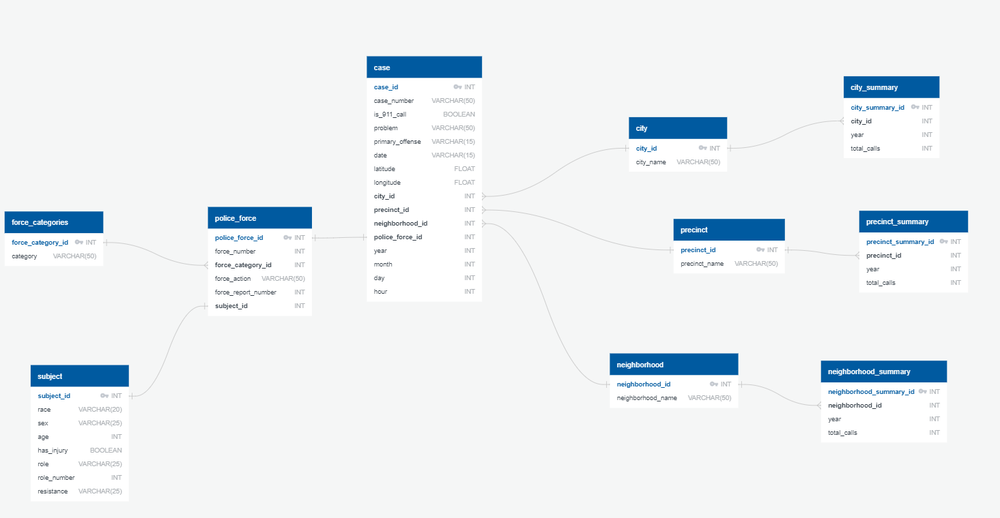

# Use of Police Force in Minneapolis
<em>Aaron Wollman, Kelsey Richardson Blackwell, Will Huang, Mark Erickson</em>

{Project Description}

## Project Proposal
[Link to Project Proposal](https://docs.google.com/document/d/1S8f17_1JH-xNafa9AJuODPuJU724BTAQOyuVbggtQM4/)

## How to Run
### Configuration Files
#### Javascript
<ol>
  <li>
    Navigate to static > js.
  </li>
  <li>
    Make a copy of <strong>config.template.js</strong> in the js directory.
	</li>
	<li>
    Rename this file to <strong>config.js</strong>.
	</li>
	<li>
	Edit the file, replacing the variables with the proper values.
	</li>
</ol>

#### Python
<ol>
  <li> 
    Make a copy of <strong>config.template.py</strong> in the root directory of this project. (UMN-Data_Analytics-Project_02)
  </li>
  <li>
    Rename this file to <strong>config.py</strong>.
  </li>
  <li>
	  Edit the file, replacing the variables with the proper values.
	</li>
</ol>

### Setup Database
For the database, this project uses a PostgresSQL database for storing police force data.
This database needs to be created and populated by following the steps below.

#### Create Schema
<ol>
  <li>
    Open an instance of pgAdmin.
  </li>
  <li>
		Create a PostgresSQL database and name it police_force.
	</li>
  <li>
    Run <strong>database/queries/create.sql</strong> to generate the tables within the new database.
  </li>
  <li>
		In the sidebar under the database that ran create.sql, open Schemas > public > Tables.
		There should be 10 tables:
        <ul>
          <li>case</li>
          <li>city</li>
          <li>city_summary</li>
          <li>force_categories</li>
          <li>neighborhood</li>
          <li>neighborhood_summary</li>
          <li>police_force</li>
          <li>precinct</li>
          <li>precinct_summary</li>
          <li>subject</li>
        </ul>
         A refresh might be required by Right Click > Refresh.
	</li>
</ol>

Here is what the database should look like:

If something goes wrong and you need to redo these instructions, make sure to run <strong>database/queries/delete.sql</strong> before the above instructions so that the tables are cleared and deleted.

### Populate Database
#### Utilize Jupyter Notebook Environment to do ETL process.
<ol>
  <li>
    Run a <strong>Command Prompt</strong> (for windows) or <strong>Terminal</strong> (for mac).
  </li>
  <li>
    Run <strong>source active NewPythonData</strong> as the command.
  </li>
  <li>
     Change directory to <strong>./database/etl</strong> and run <strong>jupyter notebook</strong> as the command.
  </li>
  <li>
    Run <strong>etl.ipynb</strong> under jupyter notebook environemnt.
  </li>
  <li>
    Hit the dobule arrow <strong>restrat the kernel, then re-run the whole notebook (with dialog)</strong> and click <strong> "Restart and Run All Cells"</strong> to process the whole ETL process.
  </li>
  The last dialog should show something like this if the ETL process has been run successfully: 
  
</ol>

#### Double Check If The Dataset Imported Successfully 
<ol>
  <li>
    Open an instance of pgAdmin.
  </li>
  <li>
    Open a query under <strong>police_force</strong> database.
  </li>
  <li>
    Run <strong>database/queries/check.sql</strong> to check the tables within the police_force.
  </li>
</ol>

### Setup Web Server
#### Utilize Flask as Web Server
<ol>
  <li>
    Run a <strong>Command Prompt</strong> (for windows) or <strong>Terminal</strong> (for mac).
  </li>
  <li>
    Run <strong>source active NewPythonData</strong> as the command.
  </li>
  <li>
    Change directory to <strong>root directory of this project</strong>.
  </li>
  <li>
    Run <strong>python app.py</strong> as the command. It will shows up a link that hold the web server.
     The result should look like this: 
    
  </li>
</ol>

### Browsing the Webpage
<ol>  
  <li>
    Open a browser and enter the link: <strong>http://127.0.0.1:5000/</strong> to visit the webpage.
  </li>
</ol>

## JSON API Documentation
### API Version
<ol>
  <li>
    Visit the link: <storng>http://127.0.0.1:5000/api</strong> to view the API Version and Update History.
  </li>
  <li>
    Click the <strong>most current</strong> API version to see the API document.
  </li>
</ol>

### API Document
#### Four perspectives are provided via this API
<ol>
  <li>
    City: 
    <ul>
      <li>A list of <strong>City and City_ID</strong> in the database.  http://127.0.0.1:5000/api/api_version/city/</li>
      <li>A list of <strong> Yearly Total Calls of Speicfic City</strong>. http://127.0.0.1:5000/api_version/v1.0/city/city_id </li>
    </ul>
  </li>

  <li>
    Neighborhood: 
    <ul>
      <li>A list of <strong>Neighborhood and Neighborhood_ID</strong> in the database.  http://127.0.0.1:5000/api/api_version/neighborhood/</li>
      <li>A list of <strong> Yearly Total Calls of Speicfic Neighborhood</strong>. http://127.0.0.1:5000/api/api_version/neighborhood/neighborhood_id </li>
    </ul>
  </li>

  <li>
    Precinct: 
    <ul>
      <li>A list of <strong>Precinct and Precinct_ID</strong> in the database.  http://127.0.0.1:5000/api/api_version/precinct/</li>
      <li>A list of <strong> Yearly Total Calls of Speicfic Precinct</strong>. http://127.0.0.1:5000/api/api_version/precinct/precinct_id </li>
    </ul>
  </li>

  <li>
    Year: 
    <ul>
      <li>A list of <strong>Years</strong> that is available in the database.  http://127.0.0.1:5000/api/api_version/year/</li>
      <li>A list of <strong> Detail Information of Each Case in Specific Year</strong>. http://127.0.0.1:5000/api/api_version/year/specific_year </li>
    </ul>
  </li>
</ol>

### The Visualizations
#### Apply a year to view the visualizaitons
<ol>
  <li>
    Select a year from the bottom right dropdown list and click <strong>Apply</storng>.
  </li>
</ol>

##### There are five differnet graphs presenting in the webpage once you applied a year.
<ol>
  <li>
    City Map: 
    <ul>
      <li>
        Showing the numbers of cases happened in an area.   You can <strong>zoom in and out</strong> to change the scope of the view.
      </li>
      <li>
        <strong>Click the mark</strong> to see the detail information of each case.
      </li>
  </li>

  <li>
    Use of Force by Race Pie Chart: 
    <ul>
      <li>Illustrating the subjects by races.
      </li>
    </ul>
  </li>

  <li>
  </li>

  <li>
  </li>

  <li>
  </li>

<ol>

## Sources
Police force data from [Open Minneapolis](https://opendata.minneapolismn.gov/datasets/police-use-of-force).
